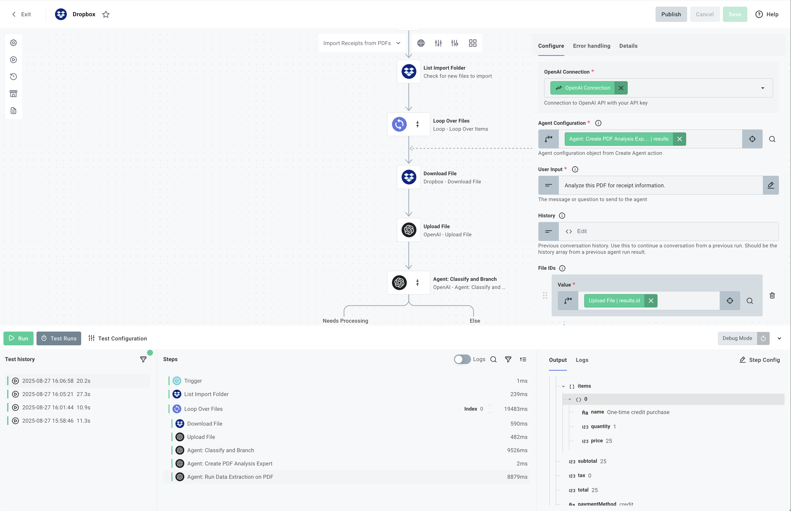

# Dropbox AI Receipt Processing Integration

This example demonstrates how to build an AI-powered integration that automatically processes PDF receipts from Dropbox using OpenAI's classification and extraction capabilities.

## Overview

This integration showcases a production-ready pattern for:

- **Monitoring** a Dropbox folder for new PDF files
- **Classifying** documents using AI to identify receipts vs non-receipts
- **Extracting** structured data from receipts using OpenAI's document analysis
- **Processing** extracted data in a structured JSON format

## Key AI Features Demonstrated

### 1. Document Classification with AI

The integration uses OpenAI's `classifyAndBranch` action to intelligently determine if a PDF is a receipt that needs processing. This demonstrates:

- Confidence-based decision making
- Branching logic based on AI analysis
- Handling of various document types

### 2. Structured Data Extraction

Using OpenAI's agent capabilities with JSON schemas, the integration:

- Converts unstructured PDF data into structured JSON
- Extracts specific fields like items, prices, totals, and vendor information
- Validates extracted data against a predefined schema

### 3. Automated Workflow

The flow runs on a schedule (every 5 minutes by default) to:

- Automatically detect new files in Dropbox
- Process them through the AI pipeline
- Return structured receipt data

## How It Works

### Main Flow: `importReceiptsFromPDFs`

The primary flow (`src/flows/importReceiptsFromPdFs.ts`) implements a complete receipt processing pipeline:

1. **File Discovery**

   - Lists all files in the configured Dropbox import folder
   - Filters for PDF files only

2. **Document Upload**

   - Downloads each PDF from Dropbox
   - Uploads to OpenAI for processing

3. **AI Classification**

   ```typescript
   // Uses AI to determine if the document is a receipt
   const classification = await context.components.openai.classifyAndBranch({
     branches: {
       "Needs Processing": "The file is an invoice or receipt",
     },
     model: "gpt-4-turbo-preview",
     // Classification logic...
   });
   ```

4. **Data Extraction**

   - For classified receipts, creates a specialized extraction agent
   - Extracts structured data matching the receipt schema:

   ```typescript
   interface ExtractedReceipt {
     receiptId: string;
     date: string;
     store: {
       name: string;
       address: string;
       phone: string;
     };
     items: Array<{
       name: string;
       quantity: number;
       price: number;
     }>;
     subtotal: number;
     tax: number;
     total: number;
     paymentMethod: "cash" | "credit" | "debit" | "other";
   }
   ```

5. **Result Processing**
   - Returns all successfully extracted receipts
   - Provides summary statistics

## Implementation Options

This integration is available in two formats:

### 1. Code-Native Implementation (TypeScript)

The `cni/` directory contains the full TypeScript implementation for developers who prefer code-based configuration.

#### Building and Importing the Code-Native Version

```bash
# Navigate to the cni directory
cd cni

# Install dependencies
npm install

# Build the integration
npm run build

# Import to your Prismatic organization
prism integrations:import --open
```

The `--open` flag will automatically open the integration in the Prismatic designer after import.

### 2. Low-Code Visual Builder

The `low-code/` directory contains a YAML definition that can be imported directly into Prismatic's visual builder.



#### Importing the Low-Code Version

##### Through the UI

1. Open the Integration Designer in your Prismatic organization
2. Click on Integration details modal
3. Select Import
4. Upload the `low-code/integration.yml` file

##### Using Prism CLI

```bash
prism integrations:import --path ./low-code/integration.yml
```

The visual flow will be created automatically with all the AI components configured.

## Project Structure

```text
dropbox-extract-receipt-from-pdf/
├── cni/                         # Code-native implementation
│   ├── src/
│   │   ├── flows/
│   │   │   └── importReceiptsFromPdFs.ts  # Main AI receipt processing flow
│   │   ├── index.ts            # Integration export
│   │   ├── componentRegistry.ts # Component configuration
│   │   └── configPages.ts      # UI configuration
│   ├── package.json            # Dependencies
│   └── tsconfig.json           # TypeScript config
└── low-code/                    # Low-code alternative
    └── integration.yml          # YAML configuration for visual import
```

## Configuration

The integration requires two main connections:

### 1. Dropbox Connection

- OAuth connection to access Dropbox files
- Permissions to read from the import folder

### 2. OpenAI Connection

- API key for OpenAI services
- Access to GPT-4 for classification
- Access to GPT-4-mini for extraction

### 3. Configuration Variables

- **Import Folder**: Path to the Dropbox folder containing receipts
- **Schedule**: Cron expression for processing frequency (default: `*/5 * * * *`)

## Usage

### Deployment

1. Deploy the integration to your Prismatic organization
2. Configure a customer instance with:
   - Dropbox OAuth connection
   - OpenAI API key
   - Import folder path

### Processing Flow

1. Upload PDF receipts to the configured Dropbox folder
2. The integration automatically processes files every 5 minutes
3. Extracted receipt data is returned in structured JSON format

### Example Output

```json
{
  "processedReceipts": [
    {
      "receiptId": "STORE-2024-001",
      "date": "2024-01-15T14:30:00Z",
      "store": {
        "name": "Example Store",
        "address": "123 Main St",
        "phone": "555-0123"
      },
      "items": [
        {
          "name": "Product A",
          "quantity": 2,
          "price": 9.99
        }
      ],
      "subtotal": 19.98,
      "tax": 1.6,
      "total": 21.58,
      "paymentMethod": "credit"
    }
  ],
  "summary": {
    "totalProcessed": 1,
    "totalFiles": 3,
    "success": true
  }
}
```

## Customization Options

### Adapting for Different Document Types

The classification and extraction prompts can be modified to handle:

- Invoices
- Purchase orders
- Expense reports
- Other structured documents

### Modifying the Extraction Schema

Edit the `RECEIPT_SCHEMA` in the flow to extract different fields:

```typescript
const CUSTOM_SCHEMA = {
  // Your custom schema definition
};
```

### Adjusting Classification Logic

Modify the classification instructions to change document filtering:

```typescript
classificationInstructions: `Your custom classification rules...`;
```

### Processing Different File Types

While this example focuses on PDFs, the pattern can be adapted for:

- Images (PNG, JPG)
- Text documents
- Scanned documents
