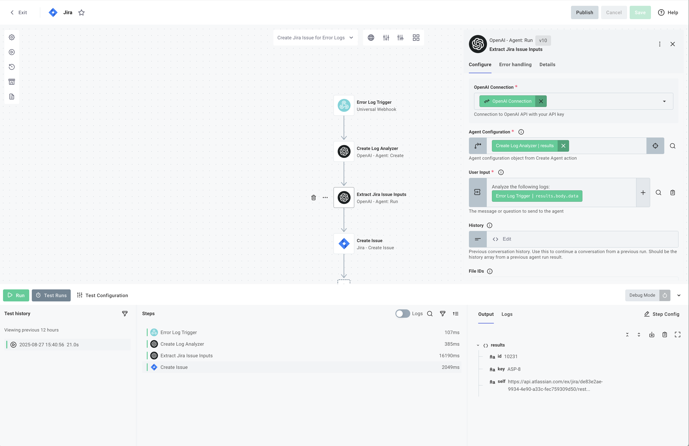

# Jira AI Error Log Processing Integration

This example demonstrates how to build an AI-powered integration that automatically analyzes system error logs and creates Jira issues for critical errors requiring attention.

## Overview

This integration showcases a production-ready pattern for:

- **Monitoring** system logs for errors and critical issues
- **Analyzing** log entries using AI to identify actionable problems
- **Extracting** structured issue data from unstructured log messages
- **Creating** Jira tickets automatically for high-confidence issues

## Key AI Features Demonstrated

### 1. Intelligent Log Analysis

The integration uses OpenAI's agent capabilities to intelligently analyze log data and determine if issues require tracking. This demonstrates:

- Confidence-based issue creation
- Severity classification
- Priority assignment based on log levels

### 2. Structured Data Extraction

Using OpenAI's agent capabilities with JSON schemas, the integration:

- Converts unstructured log messages into structured Jira issue data
- Extracts specific fields like title, description, priority, and severity
- Validates extracted data against a predefined schema

### 3. Automated Workflow

The flow can be triggered via webhook or scheduled to:

- Automatically receive and process error logs
- Analyze them through the AI pipeline
- Create Jira issues only for significant errors

## How It Works

### Main Flow: `createJiraIssueForErrorLogs`

The primary flow (`src/flows/createJiraIssueForErrorLogs.ts`) implements a complete error analysis and issue creation pipeline:

1. **Log Ingestion**

   - Receives structured log data via trigger payload
   - Validates incoming log format and content

2. **AI Agent Creation**

   - Creates a specialized log analysis agent
   - Configures with specific instructions for error identification

   ```typescript
   // Creates AI agent for log analysis
   const createLogAnalyzer = await context.components.openai.createAgent({
     instructions: LOG_ANALYZER_INSTRUCTIONS,
     model: "gpt-4-mini-2024-07-18",
     outputSchema: JSON.stringify(JIRA_ISSUE_SCHEMA),
     // Analysis configuration...
   });
   ```

3. **Log Analysis & Classification**

   - Analyzes log entries to identify critical errors
   - Determines severity levels (1-5 scale)
   - Assigns priority (High/Medium/Low)
   - Calculates confidence score for issue creation

4. **Data Extraction**

   - Extracts structured Jira issue data:

   ```typescript
   interface JiraIssueData {
     title: string;
     description: string;
     priority: "High" | "Medium" | "Low";
     issue_type: "Bug";
     severity: 1 | 2 | 3 | 4 | 5;
     confidence: number;
   }
   ```

5. **Conditional Issue Creation**
   - Checks confidence threshold before creating issues
   - Only creates Jira tickets for high-confidence errors
   - Returns analysis results for all processed logs

## Implementation Options

This integration is available in two formats:

### 1. Code-Native Implementation (TypeScript)

The `cni/` directory contains the full TypeScript implementation for developers who prefer code-based configuration.

#### Building and Importing the Code-Native Version

```bash
# Navigate to the cni directory
cd cni

# Install dependencies
npm install

# Build the integration
npm run build

# Import to your Prismatic organization
prism integrations:import --open
```

The `--open` flag will automatically open the integration in the Prismatic designer after import.

### 2. Low-Code Visual Builder

The `low-code/` directory contains a YAML definition that can be imported directly into Prismatic's visual builder.



#### Importing the Low-Code Version

##### Through the UI

1. Open the Integration Designer in your Prismatic organization
2. Click on Integration details modal
3. Select Import
4. Upload the `low-code/jira-issues-from-error-logs.yml` file

##### Using Prism CLI

```bash
prism integrations:import --path ./low-code/jira-issues-from-error-logs.yml
```

The visual flow will be created automatically with all the AI components configured.

## Project Structure

```text
jira-issues-from-error-logs/
├── cni/                         # Code-native implementation
│   ├── src/
│   │   ├── flows/
│   │   │   └── createJiraIssueForErrorLogs.ts  # Main AI error analysis flow
│   │   ├── index.ts            # Integration export
│   │   ├── componentRegistry.ts # Component configuration
│   │   └── configPages.ts      # UI configuration
│   ├── package.json            # Dependencies
│   └── tsconfig.json           # TypeScript config
├── low-code/                    # Low-code alternative
│   └── jira-issues-from-error-logs.yml  # YAML configuration for visual import
└── test-payload.json            # Example log payload for testing
```

## Configuration

The integration requires two main connections:

### 1. Jira Connection

- OAuth or API token connection to access Jira
- Permissions to create issues in the target project

### 2. OpenAI Connection

- API key for OpenAI services
- Access to GPT-4-mini for log analysis and extraction

### 3. Configuration Variables

- **Project**: Jira project ID for issue creation
- **Issue Type**: Jira issue type ID (typically "Bug")
- **Confidence Threshold**: Minimum confidence score for issue creation (default: 0.3)

## Usage

### Deployment

1. Deploy the integration to your Prismatic organization
2. Configure a customer instance with:
   - Jira connection (OAuth or API token)
   - OpenAI API key
   - Target project and issue type

### Processing Flow

1. Send error logs to the integration endpoint via webhook
2. The integration analyzes logs using AI to identify critical errors
3. Jira issues are automatically created for high-confidence problems

### Example Input

```json
{
  "service": "inventory-management",
  "environment": "production",
  "host": "inv-prod-server-03",
  "logs": [
    {
      "timestamp": "2024-08-20T09:15:46.235Z",
      "level": "ERROR",
      "logger": "InventoryUpdater",
      "message": "Critical error in inventory synchronization",
      "exception": {
        "type": "com.inventory.exception.StockSyncException",
        "message": "Unable to reconcile stock levels with warehouse",
        "stackTrace": [...]
      }
    }
  ]
}
```

### Example Output

```json
{
  "jiraIssue": {
    "id": "10234",
    "key": "PROD-567",
    "self": "https://company.atlassian.net/rest/api/2/issue/10234"
  },
  "analysis": {
    "title": "Inventory sync failure with warehouse WH-EAST-001",
    "description": "Critical error occurred during inventory synchronization...",
    "priority": "High",
    "severity": 4,
    "confidence": 0.85
  },
  "success": true
}
```

## Customization Options

### Adapting for Different Log Formats

The analysis prompts and schemas can be modified to handle:

- Application logs from different services
- Infrastructure logs
- Security events
- Performance metrics

### Modifying the Analysis Criteria

Edit the `LOG_ANALYZER_INSTRUCTIONS` in the flow to change analysis rules:

```typescript
const LOG_ANALYZER_INSTRUCTIONS = `Your custom analysis rules...`;
```

### Adjusting Confidence Thresholds

Modify the confidence thresholds to control issue creation sensitivity:

```typescript
const CONFIDENCE_THRESHOLDS = {
  HIGH: 0.8,   // Only critical errors
  MEDIUM: 0.6, // Include moderate issues
  LOW: 0.3,    // More inclusive
};
```

### Processing Different Issue Types

While this example focuses on bugs, the pattern can be adapted for:

- Feature requests from user feedback
- Security incidents
- Performance degradation alerts
- Compliance violations

### Custom Field Mapping

The integration can be extended to populate custom Jira fields based on the log analysis, such as:

- Affected components
- Customer impact
- Resolution priority
- Environment details