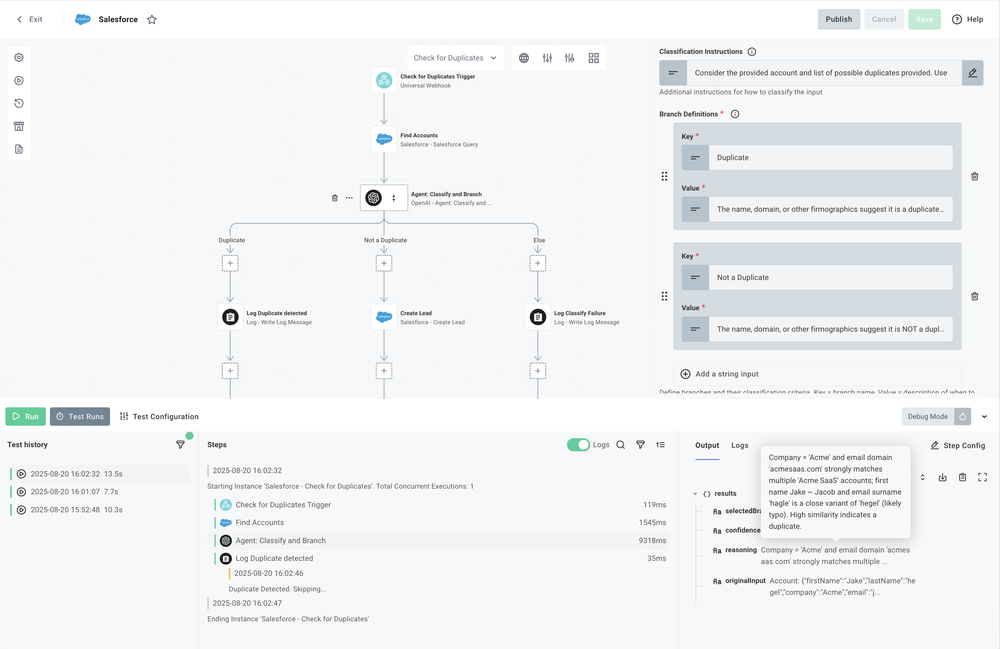
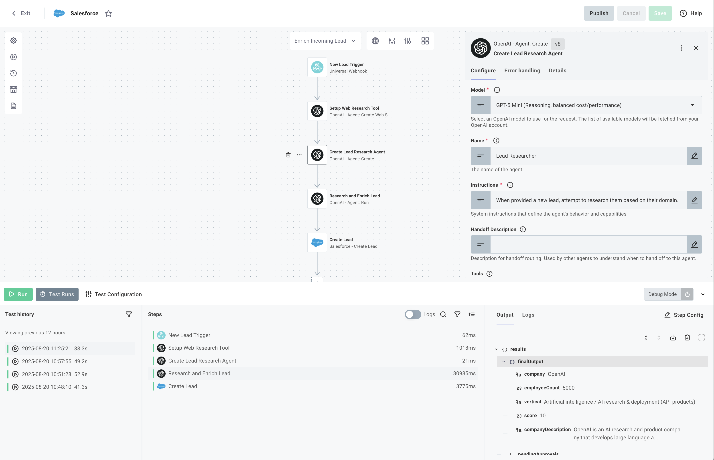

# Salesforce AI Lead Processing Integration

This example demonstrates how to build AI-powered integrations that automatically process, enrich, and route Salesforce leads using OpenAI's classification and web research capabilities.

## Overview

This integration showcases production-ready patterns for:

- **Detecting** duplicate leads using AI classification to prevent redundant entries
- **Researching** companies using web search to gather enrichment data
- **Scoring** leads based on company fit and integration needs
- **Creating** qualified leads in Salesforce with enriched data

## Key AI Features Demonstrated

### 1. Intelligent Duplicate Detection

The integration uses OpenAI's `classifyAndBranch` action to intelligently identify duplicate accounts. This demonstrates:

- Confidence-based matching with 75% threshold
- Fuzzy matching of company names and domains
- Automated routing based on classification results

### 2. Web-Based Lead Enrichment

Using OpenAI's web search capabilities, the integration:

- Researches companies based on email domain
- Extracts employee count, industry vertical, and company description
- Generates lead scores based on predefined criteria

### 3. Automated Lead Scoring

The AI agent applies business logic to score leads:

- B2B SaaS companies receive +7 points
- Companies with integration needs receive +3 points
- Non-relevant businesses (e.g., flower stores) receive -10 points
- Leads with score of 0 are automatically filtered out

## How It Works

### Flow 1: `checkForDuplicates`

The duplicate detection flow (`src/flows/checkForDuplicates.ts`) implements intelligent deduplication:

1. **Salesforce Query**

   - Searches for existing accounts with similar names
   - Retrieves account details for comparison

2. **AI Classification**

   ```typescript
   // Uses AI to determine if the lead is a duplicate
   const classification = await context.components.openai.classifyAndBranch({
     branches: {
       Duplicate:
         "The name, domain, or firmographics suggest it is a duplicate (>75% confidence)",
       "Not a Duplicate": "The account appears to be unique (>75% confidence)",
     },
     model: "gpt-5-mini-2025-08-07",
     // Classification logic...
   });
   ```

3. **Conditional Lead Creation**

   - Creates new lead only if classified as "Not a Duplicate"
   - Logs duplicate detections for audit purposes

### Flow 2: `enrichIncomingLead`

The lead enrichment flow (`src/flows/enrichIncomingLead.ts`) implements comprehensive research and scoring:

1. **Web Search Tool Setup**

   - Creates a web search tool with high context size
   - Enables comprehensive company research

2. **Lead Research Agent**

   - Creates specialized AI agent with custom instructions
   - Structured output schema for consistent data extraction:

   ```typescript
   interface EnrichedLeadData {
     company: string;
     employeeCount: number;
     vertical: string;
     score: number;
     companyDescription: string;
   }
   ```

3. **Research Execution**

   - Agent researches company based on email domain
   - Extracts structured data matching the schema
   - Applies scoring logic based on business criteria

4. **Salesforce Lead Creation**
   - Creates enriched lead with all research data
   - Skips creation for leads with score of 0
   - Includes company description and employee count

## Implementation Options

This integration is available in two formats:

### 1. Code-Native Implementation (TypeScript)

The `cni/` directory contains the full TypeScript implementation for developers who prefer code-based configuration.

#### Building and Importing the Code-Native Version

```bash
# Navigate to the cni directory
cd cni

# Install dependencies
npm install

# Build the integration
npm run build

# Import to your Prismatic organization
prism integrations:import --open
```

The `--open` flag will automatically open the integration in the Prismatic designer after import.

### 2. Low-Code Visual Builder

The `low-code/` directory contains a YAML definition that can be imported directly into Prismatic's visual builder.





#### Importing the Low-Code Version

##### Through the UI

1. Open the Integration Designer in your Prismatic organization
2. Click on Integration details modal
3. Select Import
4. Upload the `low-code/lead-enrich-salesforce.yml` file

##### Using Prism CLI

```bash
prism integrations:import --path ./low-code/lead-enrich-salesforce.yml
```

The visual flows will be created automatically with all the AI components configured.

## Project Structure

```text
salesforce-lead-enricher-and-routing/
├── cni/                         # Code-native implementation
│   ├── src/
│   │   ├── flows/
│   │   │   ├── checkForDuplicates.ts  # Duplicate detection flow
│   │   │   ├── enrichIncomingLead.ts  # Lead enrichment flow
│   │   │   └── index.ts               # Flow exports
│   │   ├── index.ts            # Integration export
│   │   ├── componentRegistry.ts # Component configuration
│   │   └── configPages.ts      # UI configuration
│   ├── package.json            # Dependencies
│   └── tsconfig.json           # TypeScript config
├── low-code/                    # Low-code alternative
│   └── lead-enrich-salesforce.yml  # YAML configuration for visual import
├── detect-duplicate-salesforce.png  # Duplicate detection flow screenshot
└── lead-enrichment-salesforce.png   # Lead enrichment flow screenshot
```

## Configuration

The integration requires two main connections:

### 1. Salesforce Connection

- OAuth connection to access Salesforce
- Permissions to create leads and query accounts
- API version 63.0 or higher

### 2. OpenAI Connection

- API key for OpenAI services
- Access to GPT-5-mini for classification and research
- Web search tool capabilities enabled

### 3. Configuration Variables

- **Salesforce Connection**: OAuth connection for Salesforce API access
- **OpenAI Connection**: API key for AI processing
- **Trigger Type**: Webhook or scheduled execution

## Usage

### Deployment

1. Deploy the integration to your Prismatic organization
2. Configure a customer instance with:
   - Salesforce OAuth connection
   - OpenAI API key
   - Webhook endpoint for lead submission

### Processing Flow

#### Duplicate Detection Flow

1. Submit lead data via webhook with format:

   ```json
   {
     "data": {
       "company": "Acme Corp",
       "email": "john@acme.com",
       "firstName": "John",
       "lastName": "Doe"
     }
   }
   ```

2. The integration queries Salesforce for similar accounts
3. AI classifies whether it's a duplicate
4. New lead is created only if unique

#### Lead Enrichment Flow

1. Submit lead data via webhook (same format as above)
2. AI researches the company using web search
3. Enriched data is extracted and scored
4. High-scoring leads are created in Salesforce

### Example Outputs

#### Duplicate Detection Response

```json
{
  "data": {
    "classification": {
      "selectedBranch": "Not a Duplicate",
      "confidence": "95%",
      "reasoning": "No existing accounts match the company name or domain"
    },
    "leadId": "00Q1234567890ABC"
  }
}
```

#### Lead Enrichment Response

```json
{
  "data": {
    "enrichedData": {
      "company": "Acme Corp",
      "employeeCount": 250,
      "vertical": "B2B SaaS",
      "score": 10,
      "companyDescription": "Acme Corp provides cloud-based integration solutions for enterprise customers, specializing in API management and workflow automation."
    },
    "leadId": "00Q1234567890DEF"
  }
}
```

## Customization Options

### Adapting Duplicate Detection Logic

Modify the classification branches and confidence thresholds:

```typescript
const CLASSIFICATION_BRANCHES = {
  Duplicate: "Custom duplicate criteria with your confidence level",
  "Not a Duplicate": "Custom unique criteria",
  "Needs Review": "Uncertain matches requiring manual review",
};
```

### Modifying Lead Scoring Criteria

Edit the scoring instructions in `enrichIncomingLead.ts`:

```typescript
const LEAD_RESEARCHER_INSTRUCTIONS = `
Your custom scoring metrics:
Enterprise companies: +10 points
Tech stack match: +5 points
Budget indicators: +3 points
Geographic match: +2 points
`;
```

### Extending the Enrichment Schema

Customize the data extraction schema:

```typescript
const CUSTOM_ENRICHMENT_SCHEMA = {
  type: "object",
  properties: {
    // Add your custom fields
    fundingRound: { type: "string" },
    techStack: { type: "array", items: { type: "string" } },
    competitorUsage: { type: "boolean" },
    // ... other fields
  },
};
```

### Processing Different CRM Systems

While this example uses Salesforce, the pattern can be adapted for:

- HubSpot CRM
- Microsoft Dynamics
- Pipedrive
- Custom CRM systems

### Adding Additional AI Capabilities

Consider extending with:

- Sentiment analysis of company news
- Competitor analysis
- Market timing indicators
- Budget prediction models
- Intent data integration
