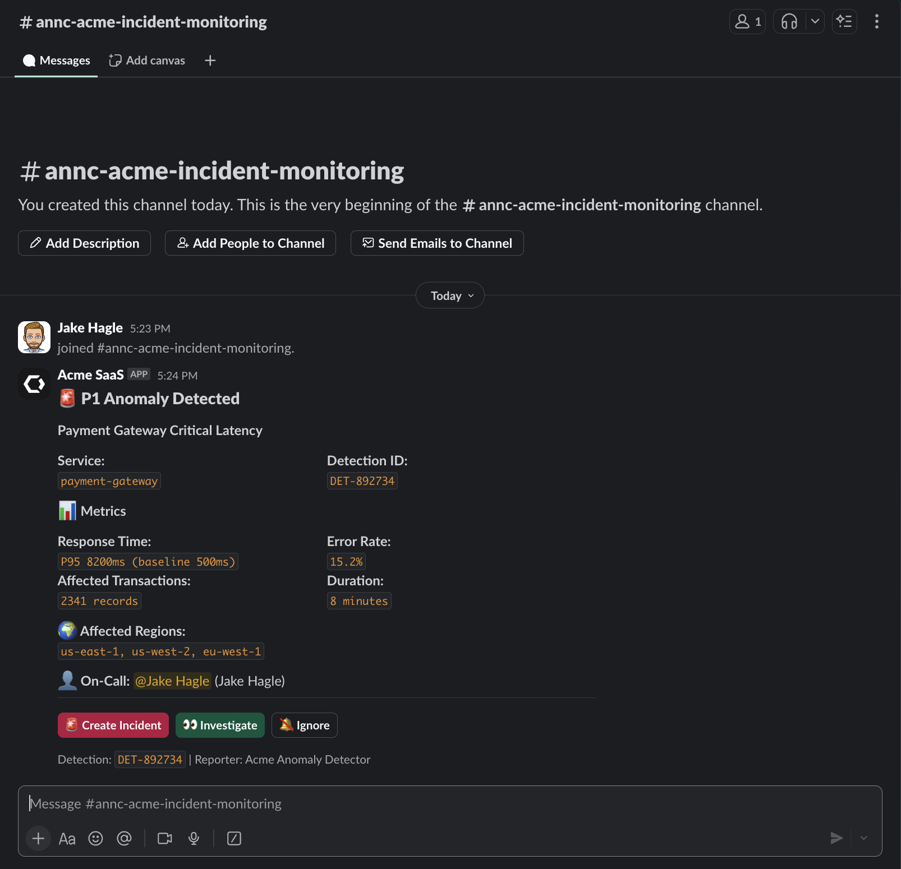
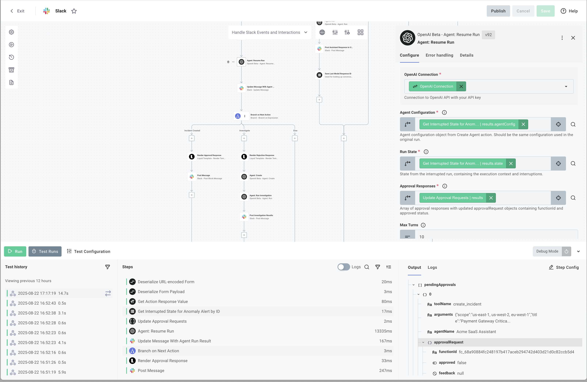

# Slack AI Incident Management Integration

This example demonstrates how to build an AI-powered incident management system that automatically processes anomaly alerts, creates incidents with human approval, and notifies on-call staff through Slack.

## Overview

This integration showcases a production-ready pattern for:

- **Receiving** alert payloads via webhook/API triggers
- **Processing** alerts using AI agents with specialized tools
- **Requesting** human approval through interactive Slack messages
- **Creating** incidents with structured data and on-call assignment
- **Notifying** teams through dedicated Slack channels

## Key AI Features Demonstrated

### 1. AI Agent with Tool Calling

The integration uses OpenAI's agent capabilities with custom tools to intelligently manage incidents. This demonstrates:

- Tool-based decision making with `get_on_call_staff` and `create_incident`
- Context-aware incident creation based on alert severity
- Structured output generation following JSON schemas

### 2. Human-in-the-Loop Approval

Using interactive Slack components, the integration:

- Presents incident details for review before creation
- Allows users to approve, investigate, or ignore alerts
- Maintains agent state during approval workflows
- Resumes agent execution after human decision

### 3. Automated Workflow Management

The system orchestrates complex multi-step workflows:

- Automatically detects new anomalies on a schedule
- Suspends agent execution for approvals
- Handles Slack interactions asynchronously
- Maintains state across distributed flows

## How It Works

### Main Flow: `newIncidentAlert`

The primary flow (`src/flows/newIncidentAlert.ts`) implements a complete incident management pipeline:

1. **Alert Reception**

   - Triggered by incoming webhook/API requests
   - Receives alert payloads directly (like test-incident-payload.json)

2. **AI Agent Initialization**

   ```typescript
   // Creates specialized incident management agent
   const agent = await context.components.openai.createAgent({
     model: "gpt-5-2025-08-07",
     instructions: AGENT_INSTRUCTIONS,
     outputSchema: INCIDENT_RESPONSE_SCHEMA,
     // Agent configuration...
   });
   ```

3. **Tool Registration**

   - `get_on_call_staff`: Retrieves current on-call engineer
   - `create_incident`: Creates incident with approval requirement

4. **Human Approval Request**

   - Agent requests incident creation
   - System sends interactive Slack message
   - Workflow suspends pending approval

   

5. **Incident Processing**
   - After approval, agent completes incident creation
   - Returns structured response with incident details
   - Posts results to configured Slack channels

### Handler Flow: `handleSlackEventsAndInteractions`

The interaction handler (`src/flows/handleSlackEventsAndInteractions.ts`) manages Slack button clicks:



1. **Event Reception**

   - Receives Slack interaction payloads
   - Validates request signatures
   - Acknowledges events immediately

2. **State Retrieval**

   - Looks up suspended agent state
   - Matches approval requests with interactions

3. **Agent Resumption**

   - Resumes agent with approval decision
   - Processes final incident creation/rejection
   - Updates original Slack message

4. **Result Notification**
   - Posts incident details or rejection reasons
   - Notifies assigned on-call staff
   - Creates dedicated incident channels

### Supporting Flows

#### `getOnCallStaff`

Retrieves on-call information for services:

```typescript
interface OnCallStaff {
  id: string;
  name: string;
  handle: string;
  email: string;
  shift_start: string;
  shift_end: string;
  escalation_level: number;
}
```

#### `createIncident`

Creates incidents with comprehensive details:

```typescript
interface IncidentCreation {
  title: string;
  description: string;
  severity: "P0" | "P1" | "P2" | "P3" | "P4";
  service: string;
  assignee: OnCallStaff;
  metrics?: {
    affected_count: number;
    error_rate: number;
    response_time_ms: number;
  };
}
```

#### `getIncidents`

Queries existing incidents for deduplication and context.

## Implementation Options

This integration is available in two formats:

### 1. Code-Native Implementation (TypeScript)

The `cni/` directory contains the full TypeScript implementation for developers who prefer code-based configuration.

#### Building and Importing the Code-Native Version

```bash
# Navigate to the cni directory
cd cni

# Install dependencies
npm install

# Build the integration
npm run build

# Import to your Prismatic organization
prism integrations:import --open
```

The `--open` flag will automatically open the integration in the Prismatic designer after import.

### 2. Low-Code Visual Builder

The `low-code/` directory contains a YAML definition that can be imported directly into Prismatic's visual builder.

#### Importing the Low-Code Version

##### Through the UI

1. Open the Integration Designer in your Prismatic organization
2. Click on Integration details modal
3. Select Import
4. Upload the `low-code/integration.yml` file

##### Using Prism CLI

```bash
prism integrations:import --path ./low-code/integration.yml
```

The visual flow will be created automatically with all the AI components configured.

## Project Structure

```text
slack-acme-incident-monitoring/
├── cni/                         # Code-native implementation
│   ├── src/
│   │   ├── flows/
│   │   │   ├── newIncidentAlert.ts         # Main AI incident flow
│   │   │   ├── handleSlackEventsAndInteractions.ts  # Slack handler
│   │   │   ├── createIncident.ts           # Incident creation tool
│   │   │   ├── getOnCallStaff.ts          # On-call lookup tool
│   │   │   └── getIncidents.ts            # Incident query tool
│   │   ├── util/
│   │   │   ├── approvalHandler.ts         # Approval state management
│   │   │   └── slackMessageBuilders.ts    # Slack message formatting
│   │   ├── index.ts            # Integration export
│   │   ├── componentRegistry.ts # Component configuration
│   │   └── configPages.ts      # UI configuration
│   ├── package.json            # Dependencies
│   └── tsconfig.json           # TypeScript config
├── low-code/                    # Low-code alternative
│   └── integration.yml          # YAML configuration for visual import
├── flow-handler.png            # Flow diagram
└── slack-approval-message.png  # UI example
```

## Configuration

The integration requires two main connections:

### 1. Slack Connection

- OAuth connection with required scopes:
  - `chat:write` - Post messages
  - `chat:write.public` - Post to public channels
  - `chat:write.customize` - Post with custom username/avatar
  - `channels:read` - List channels
  - `users:read` - User information
- Signing secret for webhook validation
- Client ID and secret for OAuth flow

### 2. OpenAI Connection

- API key for OpenAI services
- Access to GPT-5 model for agent execution
- Support for tool calling and structured outputs

### 3. Alert Channel

- **Alert Channel**: Slack channel where approval requests are posted

## Usage

### Deployment

1. Deploy the integration to your Prismatic organization
2. Configure a customer instance with:
   - Slack OAuth connection
   - OpenAI API key
   - Alert Channel selection
3. Note the webhook URL for the `newIncidentAlert` flow

### Processing Flow

1. External monitoring system sends alert payload to the webhook URL
2. AI agent processes the alert and retrieves on-call staff
3. Agent requests approval to create incident
4. Approval message sent to configured Slack channel
5. On-call engineer reviews and approves/rejects
6. Agent completes incident creation and posts results

### Testing

You can test the integration using the provided test payload:

```bash
# Send test alert to the newIncidentAlert flow webhook
curl -X POST https://your-instance-url/webhooks/flows/new-incident-alert \
  -H "Content-Type: application/json" \
  -d @test-incident-payload.json
```

The `test-incident-payload.json` file contains a sample alert:

```json
{
  "detection_id": "DET-892734",
  "timestamp": "2025-01-22T18:12:00Z",
  "service": "payment-gateway",
  "severity": "P1",
  "anomaly_type": "service_degradation",
  "title": "Payment Gateway Critical Latency",
  "description": "Payment processing experiencing severe delays affecting customer transactions",
  "metrics": {
    "current_p95_response_time": "8200ms",
    "baseline_p95_response_time": "500ms",
    "error_rate": "15.2%",
    "affected_transactions": 2341,
    "duration_minutes": 8
  },
  "affected_regions": ["us-east-1", "us-west-2", "eu-west-1"],
  "team": "payments-team"
}
```

### Example Output

#### Approval Request

```json
{
  "channel": "#platform-alerts",
  "blocks": [
    {
      "type": "section",
      "text": {
        "text": "🚨 *Incident Creation Request*\n*Service:* payment-gateway\n*Severity:* P1 - Critical\n*Title:* Payment Processing Latency Spike"
      }
    },
    {
      "type": "actions",
      "elements": [
        {
          "type": "button",
          "text": "✅ Approve",
          "style": "primary",
          "action_id": "approve_incident"
        },
        {
          "type": "button",
          "text": "🔍 Investigate",
          "action_id": "investigate_alert"
        },
        {
          "type": "button",
          "text": "❌ Ignore",
          "style": "danger",
          "action_id": "ignore_alert"
        }
      ]
    }
  ]
}
```

#### Incident Created Response

```json
{
  "message_type": "incident_created",
  "channel": "#incidents",
  "summary": "P1 incident created for payment-gateway: Critical latency affecting 2341 transactions",
  "incident_id": "INC-2025-4892",
  "incident_url": "https://incidents.acme.io/incidents/INC-2025-4892",
  "incident_channel": "#inc-2025-4892",
  "assignee_mention": "U01A5A5HU0Y"
}
```

#### Incident Rejected Response

```json
{
  "message_type": "incident_rejected",
  "channel": "#platform-alerts",
  "summary": "Alert DET-892734 marked as false positive by @jake.hagle",
  "anomaly_id": "DET-892734",
  "rejection_reason": "false_positive",
  "rejection_notes": "Known transient spike during deployment"
}
```

## Customization Options

### Adapting for Different Alert Systems

The agent instructions and schemas can be modified to handle various alert sources:

- PagerDuty incidents
- Datadog monitors
- New Relic alerts
- Custom monitoring systems

### Modifying the Agent Behavior

Edit the `AGENT_INSTRUCTIONS` in the flow to change agent behavior:

```typescript
const CUSTOM_INSTRUCTIONS = `Your custom agent instructions...`;
```

### Adjusting Approval Workflows

Customize approval requirements based on:

- Incident severity (auto-approve P4, require approval for P0-P1)
- Service criticality
- Time of day (business hours vs after-hours)
- Previous incident frequency

### Adding Custom Tools

Extend agent capabilities with additional tools:

```typescript
// Example: Check maintenance windows
const maintenanceWindowTool = {
  name: "check_maintenance",
  description: "Check if service is in maintenance",
  // Tool implementation...
};
```

### Processing Different Alert Types

The pattern can be adapted for:

- Security incidents
- Performance degradations
- Capacity warnings
- Compliance violations

## Advanced Features

### State Management

The integration uses persistent state to:

- Maintain agent context during approvals
- Track pending approval requests
- Store incident history for deduplication

### Observability

Built-in logging and metrics for:

- Agent execution traces
- Approval response times
- Incident creation success rates
- Tool usage patterns
