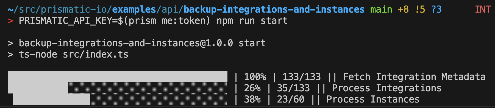

# Backup Integrations and Instances

This example script demonstrates how you could wrap Prismatic's GraphQL API to create a backup of all of your integrations and their deployed instances.
This is handy if you'd like to save a snapshot of your integrations and instances.



When it's run, a directory called `backups/` will be created, with a subfolder for each integration you've backed up, along with their respective instances.

## Running the script

To run this script, you will need to supply a Prismatic API key as an environment variable `PRISMATIC_API_KEY`.
If you have the [prism CLI tool](https://www.npmjs.com/package/@prismatic-io/prism) installed, you can use it to fetch a valid token:

```bash
PRISMATIC_API_KEY=$(prism me:token) npm run start
```

Note that this script runs against the US Commercial stack by default. If you'd like to run it against another region (EU, AUS, CA, GovCloud, private cloud, etc.) edit the value in `src/config.ts`.
