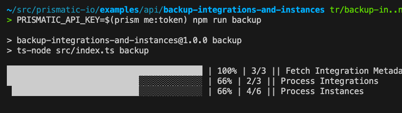
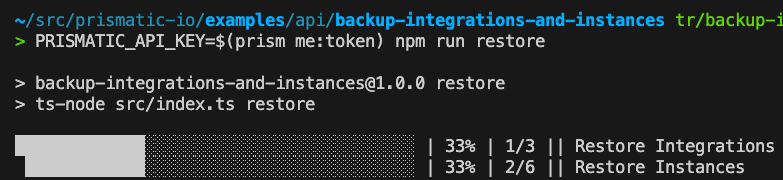

# Backup Integrations and Instances

This example script demonstrates how you could wrap Prismatic's GraphQL API to create a backup of all of your integrations and their deployed instances.
This is handy if you'd like to save a snapshot of your integrations and instances.



When it's run, a directory called `backups/` will be created, with a subfolder for each integration you've backed up, along with their respective instances.

In the unlikely event that an entire region is damaged and not recoverable (we don't expect this to happen!) you can then restore your integrations and instances.



## Running the script

To run this script, you will need to supply a Prismatic API key as an environment variable `PRISMATIC_API_KEY`.
If you have the [prism CLI tool](https://www.npmjs.com/package/@prismatic-io/prism) installed, you can use it to fetch a valid token:

```bash
PRISMATIC_API_KEY=$(prism me:token) npm run backup
```

Note that this script runs against the US Commercial stack by default. If you'd like to run it against another region (EU, AUS, CA, GovCloud, private cloud, etc.) also provide a `PRISMATIC_URL` environment variable for your region.

If you've already generated a backup of your data and would like to now restore your backup, run

```bash
PRISMATIC_API_KEY=$(prism me:token) npm run restore
```

Note: Running the restore script will overwrite any integrations and instances currently in your tenant with ones saved in the backup.
Use caution, as restoring old backups can overwrite newer work.
