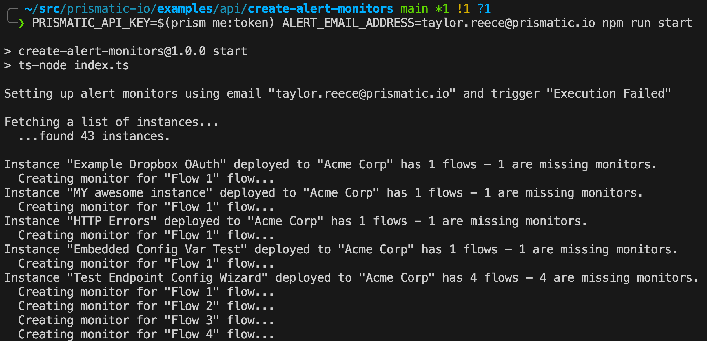
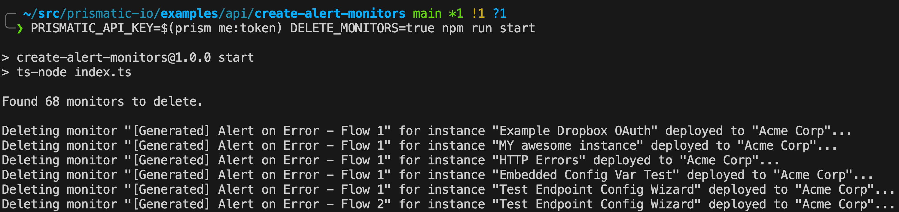

# Programmatically Create Alert Monitors

This script demonstrates how to programmatically add alert monitors to your instances through Prismatic's GraphQL API.
Documentation for the API can be found at [prismatic.io/docs](https://prismatic.io/docs/api/api-overview/).

`index.ts` creates an authenticated GraphQL client and uses that client to make requests to the Prismatic API.
Files in the `queries/` directory wrap various GraphQL queries and mutations to do things like list instances or create new alert monitors.

This script is idempotent, and will only create monitors if they do not already exist.

## Running this script

To run this script, you will need to supply an API key and an email address you would like to alert that matches a user in your organization.
Those values can be shared as environment variables `PRISMATIC_API_KEY` and `ALERT_EMAIL_ADDRESS` respectively.
If you have the [prism CLI tool](https://www.npmjs.com/package/@prismatic-io/prism) installed, you can use it to fetch a valid token:

```bash
PRISMATIC_API_KEY=$(prism me:token) ALERT_EMAIL_ADDRESS=customer-success@example.com npm run start
```



## Deleting monitors

Monitors that are created programmatically through this script can be removed with this script.
All monitors created by this script are prepended with `[Generated] Alert on Error - `.
Running this script with a `DELETE_MONITORS` environment variable set will delete all monitors with a similar name.

```bash
PRISMATIC_API_KEY=$(prism me:token) DELETE_MONITORS=true npm run start
```



## Extending this script

This script is meant to be used as an example to illustrate how to programmatically create alert monitors.
You can extend this script's logic however you like.
For example, there may only be a set of instances you want to create alert monitors for.
Or, you may want to alert a webhook URL rather than a person, or want to alert on a different set of triggers.
Use this script as a jumping-off point to build your own alerting logic.
