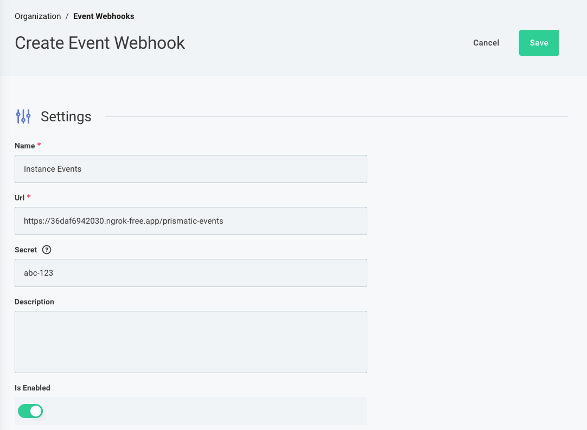

# Prismatic Event Webhook Handler

This example web application demonstrates how to receive and handle event webhooks from Prismatic. It listens for instance lifecycle events and maintains a local SQLite database of active flow webhook URLs that can be used by your application.

## What It Does

This application accepts [event webhook requests from Prismatic](https://prismatic.io/docs/webhooks/) and, depending on the event type, tracks flows' webhook URLs in an SQLite database. This allows you to:

- Automatically discover webhook URLs when new instances are deployed
- Keep your local database in sync with Prismatic instance lifecycle changes
- Maintain a queryable record of which webhooks are active for each customer and flow without querying Prismatic every time

## How It Works

When Prismatic sends event webhooks (e.g., when an instance is updated, enabled, disabled, or deleted), this app:

1. Verifies the webhook signature using HMAC-SHA256 validation
2. Parses and validates the event payload
3. Takes appropriate action based on the event type:
   - **instance.updated**: Queries Prismatic API to get flow webhook URLs and stores them
   - **instance.enabled**: Marks webhooks as enabled in the database
   - **instance.disabled**: Marks webhooks as disabled in the database
   - **instance.deleted**: Removes webhooks from the database

## File Structure

### [`src/server.ts`](src/server.ts)

The main Express server that handles incoming webhook requests at the `/prismatic-event` endpoint. Key responsibilities:

- Sets up the Express application
- Verifies webhook signatures using HMAC-SHA256 (required by Prismatic)
- Validates incoming payloads against the expected schema
- Routes events to appropriate handlers based on `event_type`
- Returns appropriate HTTP status codes

### [`src/config.ts`](src/config.ts)

Configuration management using environment variables. Loads and validates:

- `PORT`: Server port (default: 3000)
- `NODE_ENV`: Environment (development/production)
- `SIGNING_SECRET`: HMAC signing secret for webhook verification (required)
- `DB_FILE`: SQLite database file path (default: webhooks.sqlite)
- `PRISMATIC_API_URL`: Prismatic GraphQL API endpoint (required)
- `PRISMATIC_API_TOKEN`: API token for querying Prismatic (required)

### [`src/types.ts`](src/types.ts)

TypeScript type definitions using Zod schemas. Defines the structure of Prismatic event webhook payloads, including:

- Supported event types (instance.updated, instance.enabled, instance.disabled, instance.deleted)
- Event metadata (user, timestamp, organization_id)
- Instance information

### [`src/database.ts`](src/database.ts)

SQLite database initialization and setup. Creates the `webhooks` table with columns:

- `id`: Primary key
- `customer_id`: Customer's external ID
- `flow_id`: Flow identifier
- `instance_id`: Instance identifier
- `webhook_url`: The actual webhook URL to call
- `enabled`: Boolean flag indicating if the webhook is active
- `created_at`: Timestamp

### [`src/prismatic.ts`](src/prismatic.ts)

Prismatic API client using GraphQL. Provides the `getInstanceDetails()` function that:

- Queries the Prismatic GraphQL API for instance information
- Retrieves flow configurations and their associated webhook URLs
- Returns customer information and flow details

### [`src/handleEvents.ts`](src/handleEvents.ts)

Event handler functions that implement business logic for each event type:

- **`handleInstanceUpdated()`**: Fetches instance details from Prismatic and inserts webhook URLs into the database
- **`handleInstanceEnabled()`**: Sets `enabled = TRUE` for all webhooks associated with the instance
- **`handleInstanceDisabled()`**: Sets `enabled = FALSE` for all webhooks associated with the instance
- **`handleInstanceDeleted()`**: Removes all webhooks associated with the instance from the database

## Setup

1. Install dependencies:

   ```bash
   npm install
   ```

2. Create a `.env` file with required configuration:

   ```env
   SIGNING_SECRET=your_webhook_signing_secret
   PRISMATIC_API_URL=https://app.prismatic.io/api
   PRISMATIC_API_TOKEN=your_api_token
   PORT=3000
   DB_FILE=webhooks.sqlite
   ```

3. Run the server locally

   ```bash
   npm run dev
   ```

4. Expose your local server to the internet using a tool like [ngrok](https://ngrok.com/) to receive webhooks from Prismatic.

   ```bash
    ngrok http 3000
   ```

   This will yield an ngrok endpoint. Use this URL to configure your Prismatic event webhooks.
   

## Security

This application implements proper webhook security by:

- Verifying HMAC signatures on all incoming webhooks using the `x-webhook-signature` header
- Rejecting requests with invalid signatures (401 Unauthorized)
- Validating payload structure using Zod schemas
- Using environment variables for sensitive configuration

## Database Schema

The SQLite database maintains a simple schema:

```sql
CREATE TABLE webhooks (
   id INTEGER PRIMARY KEY AUTOINCREMENT,
   customer_id TEXT,
   flow_id TEXT,
   instance_id TEXT,
   webhook_url TEXT,
   enabled INTEGER DEFAULT 1,
   created_at DATETIME DEFAULT CURRENT_TIMESTAMP
);
```

Query this table to discover which webhook URLs to call for your customers' integrations.

## Learn More

- [Prismatic Event Webhooks Documentation](https://prismatic.io/docs/webhooks/)
- [Prismatic API Documentation](https://prismatic.io/docs/api/)
